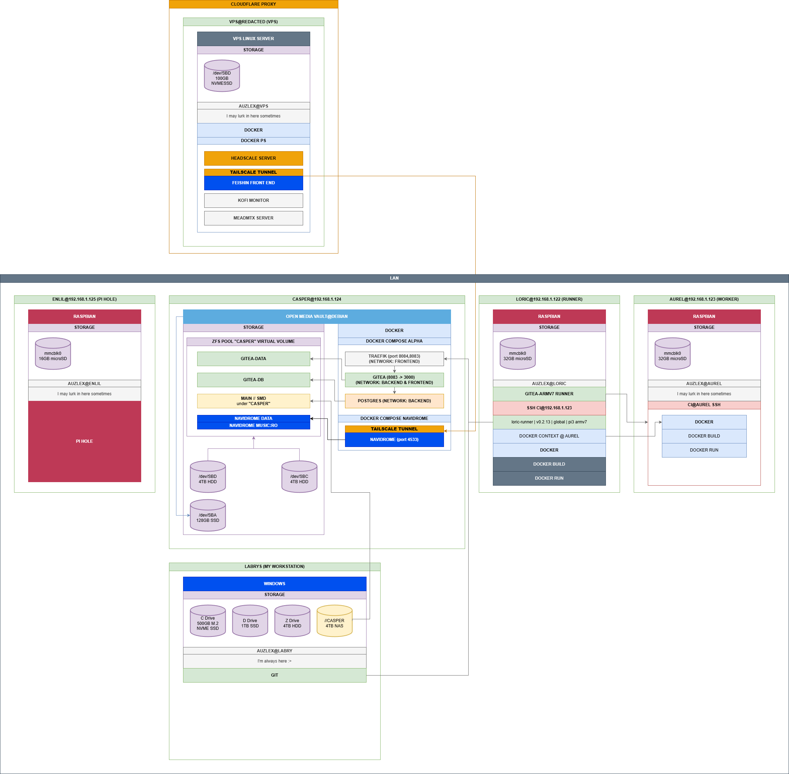

# My Home Lab
## Introduction

Welcome to the My Home Lab repository. The documentation includes setup guides, configurations, and architecture details for my benefit so that I can remember what I did and how I did it, documentation may not be perfect or consistently updated!

## Architecture Diagram

In the diagram above, you can see a simple architecture/setup of various computer devices that I setup on my network. In this example you can see the devices **ENLIL**, **CASPER**, **LORIC**, **AUREL** and **LABRYS**.

This is my MK-1 "home-lab" a simple manual orchestration setup. to understand the fundamentals in what goes into these automated systems.

I have a runner node with an optional worker node which can be sent tasks via shell in ssh. Currently LORIC handles all jobs dispatched by casper via gitea workflows and will offload its building and docker related activities to AUREL. All gitea workflow jobs are handled by 2 seperate computers.

My next goals is to expand the workers and determine where certain offloaded tasks should be determined and handled. I will also look into the use of kubernetes with slightly more powerful devices.

## Notes

- The setup above will need to have their static ips migrated to a much lower ipv4 range, this is so I can tell the router to avoid assigning any future devices on the network to be accidentally assigned to one of these critical ips. There are many ways to go about this so for the moment it will be on my **TODO**.

## Website Link
### For detailed documentation, please visit the [GitHub Pages site](https://auzlex.github.io/my-home-lab/).

