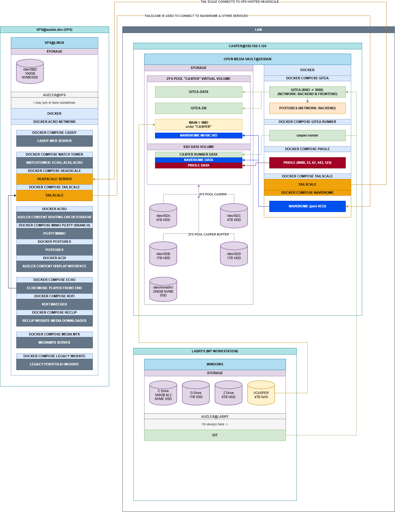

# My Home Lab
## Introduction

Welcome to the My Home Lab repository. This project documents my home lab, a personal infrastructure built around data privacy and digital autonomy. Rather than handing control of my data to third-party platforms, I self-host the services I rely on daily, keeping everything under my own roof. It's a living system that grows as I do, and this site exists as both a reference for myself and a transparent look at how it all fits together.

## Current Architecture (MK-2)

The home lab has been reformed into a **unified, privacy-focused architecture** built around a single high-performance computer:

- **Services** run on a dedicated compute system
- **Access** is provided securely through **Tailscale** mesh networking
- **Control plane** is self-hosted via **Headscale** on my VPS
- **Authorization** is managed by **ACRO** (similar to Authentik, with deeper code-level control)
- **Domain protection** via my domain with ACRO-secured access

This approach provides granular control, privacy, and security while maintaining ease and reliability.

### Featured Services

**ECHO Music Streaming**
Currently, the main service running on this infrastructure is a self-hosted music streaming platform built around **Navidrome**. I developed a custom frontend called **ECHO** to tailor the experience to my specific needs. 

ECHO integrates directly with **ACRO** for Single Sign-On (SSO), ensuring that only authorized users can securely authenticate and access streaming content from my personal music library. This setup demonstrates a complete full-stack deployment: managing the infrastructure, securing the network, and developing both the user-facing application and its authentication layer.

**Gitea Source Control & CI/CD**
Another core service is my self-hosted **Gitea** instance, which acts as the central hub for my coding and game development work. It heavily utilizes **Git LFS** (Large File Storage) to reliably handle the large binary assets required for my Unity projects. Coupled with a local runner for CI/CD tasks, this provides a completely private, high-performance development pipeline.

## Legacy Architecture (MK-1 - Archived)

### Original Setup

**Note:** This diagram shows the original MK-1 setup and is no longer active.

The original setup featured multiple distributed nodes for learning purposes:
- ~~**ENLIL**~~ - **RETIRED** - Local DNS resolver with Pi-hole
- **CASPER** - NAS storage (still active)
- ~~**LORIC**~~ - **RETIRED** - Orchestrator node and CI/CD runner
- ~~**AUREL**~~ - **RETIRED** - Worker node for heavy builds
- **LABRYS** - Storage device

MK-1 was valuable for understanding distributed CI/CD infrastructure, but has been consolidated into the cleaner MK-2 design.

## Notes

- The setup above will need to have their static ips migrated to a much lower ipv4 range, this is so I can tell the router to avoid assigning any future devices on the network to be accidentally assigned to one of these critical ips. There are many ways to go about this so for the moment it will be on my **TODO**.

## Website Link
### For detailed documentation, please visit the [GitHub Pages site](https://auzlex.github.io/my-home-lab/).

