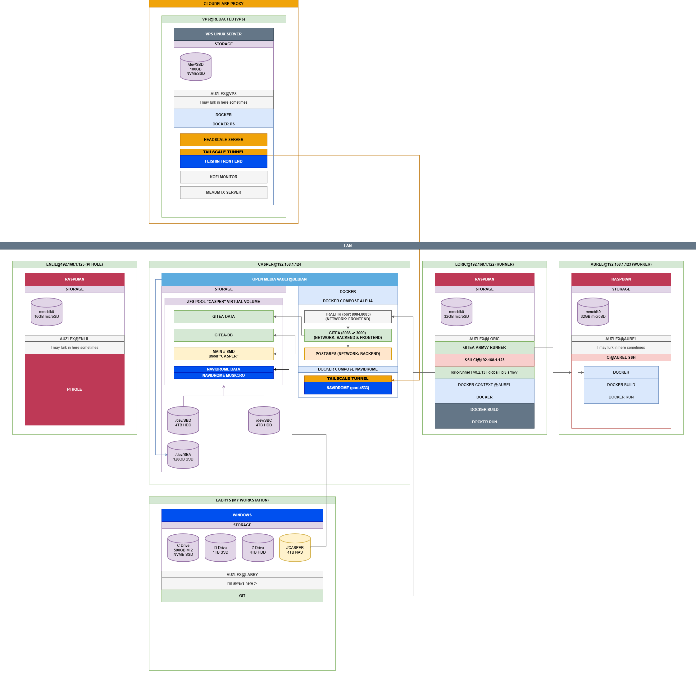

# My Home Lab Documentation

This project documents my home lab, a personal infrastructure built around data privacy and digital autonomy. Rather than handing control of my data to third-party platforms, I self-host the services I rely on daily, keeping everything under my own roof. It's a living system that grows as I do, and this site exists as both a reference for myself and a transparent look at how it all fits together.

## Current Setup (MK-2)

The home lab has been reformed into a **cleaner, unified architecture** built around a single high-performance computer that runs core services. Access to services is provided through:

- **Tailscale** - Secure mesh networking to access services remotely
- **Headscale** - Self-hosted Tailscale control server on my VPS
- **ACRO** - Authorization and authentication system (similar to Authentik but with greater code-level control)
- **Domain Protection** - Services delivered through my domain with ACRO-protected access

This approach provides granular control, privacy, and security while maintaining ease of access.

### Featured Services

**ECHO Music Streaming**
Currently, the main service running on this infrastructure is a self-hosted music streaming platform built around **Navidrome**. I developed a custom frontend called **ECHO** to tailor the experience to my specific needs. 

ECHO integrates directly with **ACRO** for Single Sign-On (SSO), ensuring that only authorized users can securely authenticate and access streaming content from my personal music library. This setup demonstrates a complete full-stack deployment: managing the infrastructure, securing the network, and developing both the user-facing application and its authentication layer.

**Gitea Source Control & CI/CD**
Another core service is my self-hosted **Gitea** instance, which acts as the central hub for my coding and game development work. It heavily utilizes **Git LFS** (Large File Storage) to reliably handle the large binary assets required for my Unity projects. Coupled with a local runner for CI/CD tasks, this provides a completely private, high-performance development pipeline.

## Architecture Diagram (MK-2 - Current)

  

This diagram shows the current MK-2 architecture with the unified compute node, Tailscale mesh networking, Headscale control plane, and ACRO authorization layer.

## Architecture Diagram (MK-1 - Retired)

  

**Note:** The diagram below shows the original MK-1 architecture and is no longer active. See the retired nodes section below.

### Retired Systems (MK-1)

The original setup consisted of multiple distributed nodes:
- ~~**ENLIL**~~ - **RETIRED** - Was a local DNS resolver running Pi-hole
- **CASPER** - Still active as NAS storage
- ~~**LORIC**~~ - **RETIRED** - Was the orchestrator/CI/CD runner node
- ~~**AUREL**~~ - **RETIRED** - Was the worker node for heavy builds
- **LABRYS** - Workstation

The MK-1 architecture was a valuable learning experience for understanding distributed CI/CD infrastructure, but has been consolidated into the cleaner MK-2 single-computer design focused on privacy and control.

## Notes

- The setup above will need to have their static ips migrated to a much lower ipv4 range, this is so I can tell the router to avoid assigning any future devices on the network to be accidentally assigned to one of these critical ips. There are many ways to go about this so for the moment it will be on my **TODO**.

## Documentation Pages

### Active Systems
- [CASPER - Gitea Server & Network Attached Storage](casper.md)
- [Maintenance Log](maintenance-log.md)

### Retired Systems (MK-1 Archive)
- [LORIC - Orchestrator Node (Retired)](loric.md)
- [AUREL - Worker Node (Retired)](aurel.md)
- [ENLIL - Local DNS Resolver (Retired)](enlil.md)


