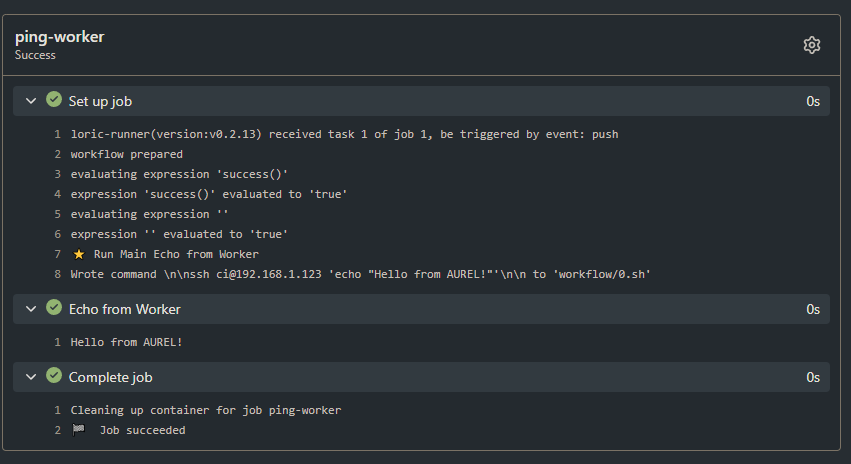

[← Back to Home](index.md)

# LORIC - Orchestration Node (Gitea Runner)

* **Hostname:** LORIC  
* **Type:** Raspberry Pi 3 B+
* **IP Address:** 192.168.1.122 **(STATIC)**
* **Architecture:** ARMv7 (Raspberry Pi 3 B+)  

### Purpose
**LORIC** acts as the dedicated **runner node** within the home-lab CI/CD infrastructure.
It is responsible for polling the Gitea server on CASPER, orchestrating workflow execution,
and dispatching jobs to worker nodes like AUREL while maintaining workflow scheduling and coordination.

### System Information

**Kernel / OS**
- Kernel: 6.12.62+rpt-rpi-v8
- Build: #1 SMP PREEMPT Debian 1:6.12.62-1+rpt1 (2025-12-18)
- Architecture: aarch64
- Distro: Debian (Raspberry Pi variant)

**SSH Stack**
- OpenSSH: OpenSSH_10.0p2 Debian-7
- OpenSSL: 3.5.4 (30 Sep 2025)

**Docker**
- Docker Engine: 26.1.5+dfsg1
- Build: a72d7cd

## Setup Steps
**LORIC** was setup using the following steps and instructions:

### 1. Install Docker

```bash
auzlex@LORIC:~ $ sudo apt update && sudo apt install -y docker.io docker-compose && sudo systemctl enable docker --now
```

* Docker is used to run any containerized jobs dispatched from **AUREL** or directly from workflows.

### 2. Create Runner Directory

```bash
auzlex@LORIC:~ $ mkdir ~/gitea-runner && cd ~/gitea-runner
```

### 3. Download Gitea Actions Runner

```bash
auzlex@LORIC:~/gitea-runner $ curl -LO https://dl.gitea.com/act_runner/0.2.13/act_runner-0.2.13-linux-arm-7.xz
```

* Version **0.2.13**, architecture **arm-7** matches Raspberry Pi 3 B+

### 4. Extract and Prepare Runner

```bash
auzlex@LORIC:~/gitea-runner $ unxz act_runner-0.2.13-linux-arm-7.xz
auzlex@LORIC:~/gitea-runner $ mv act_runner-0.2.13-linux-arm-7 act_runner
auzlex@LORIC:~/gitea-runner $ chmod +x act_runner
```

### 5. Fix DNS Resolution for CASPER

* Edit `/etc/hosts` to allow LORIC to resolve `casper.local`:
(This one is important because I have gitea working under reverse proxy via traefik so I need `http://casper.local:8083`)

```bash
auzlex@LORIC:~ $ sudo nano /etc/hosts
```

* Add:

```
192.168.1.124 casper.local
```

### 6. Register Runner with Gitea

* Obtain the **registration token** from CASPER (Gitea UI: Settings → Actions → Runners → Add Runner)

```bash
auzlex@LORIC:~/gitea-runner $ ./act_runner register --instance http://casper.local:8083 --token <TOKEN> --name loric-runner --labels pi3,armv7 --no-interactive
```

* `<TOKEN>`: token obtained from CASPER
* `--labels` can be customized for workflow targeting

### 7. Start Runner (Manual)

```bash
auzlex@LORIC:~/gitea-runner $ ./act_runner daemon
```

* Runner will poll CASPER and appear online in Gitea

### 8. Make Runner Persistent with systemd

1. Create service file:

```bash
auzlex@LORIC:~ $ sudo nano /etc/systemd/system/gitea-runner.service
```

Paste:

```ini
[Unit]
Description=Gitea Actions Runner
After=network.target

[Service]
Type=simple
User=auzlex
WorkingDirectory=/home/auzlex/gitea-runner
ExecStart=/home/auzlex/gitea-runner/act_runner daemon
Restart=always

[Install]
WantedBy=multi-user.target
```

2. Enable and start the service:

```bash
auzlex@LORIC:~ $ sudo systemctl daemon-reload
auzlex@LORIC:~ $ sudo systemctl enable gitea-runner
auzlex@LORIC:~ $ sudo systemctl start gitea-runner
```

3. Check status:

```bash
auzlex@LORIC:~ $ sudo systemctl status gitea-runner
```

## Testing The Runner

We will test running a task on LORIC to `echo "Hello from AUREL!"`


In the example image above, you can see the worker is successfully running my gitea workflow test.yml within my CICD-Test repo. The test.yml is to instruct commands under the ssh.

```yml
name: Test Worker Connectivity

on:
  push:
    branches:
      - main

jobs:
  ping-worker:
    runs-on: pi3  # label matches LORIC and AUREL worker
    steps:
      - name: Echo from Worker
        run: ssh ci@192.168.1.123 'echo "Hello from AUREL!"'

```

## Building on AUREL

```yml
name: Docker Build on AUREL

on:
  push:
    branches:
      - main

jobs:
  docker-build:
    runs-on: pi3
    steps:
      - name: Checkout Code
        uses: actions/checkout@v3

      - name: Build Docker Image Remotely
        run: |
          ssh ci@192.168.1.123 '
            docker build -t ci-test-image .
            docker run --rm ci-test-image
          '

```

## Summary of LORIC Role

* **Gitea Actions Runner:** Polls CASPER for workflows
* **Dispatches jobs:** Can run Docker jobs locally or target AUREL worker node
* **Persistent Service:** Runs as systemd service, auto-starts on boot
* **Labels:** `pi3`, `armv7` (used for targeting specific workflows)

### Notes

* Ensure `/etc/hosts` entry for `casper.local` remains in place for DNS resolution
* Runner binary located at: `~/gitea-runner/act_runner`
* Docker must remain installed for workflows that use containerized jobs

